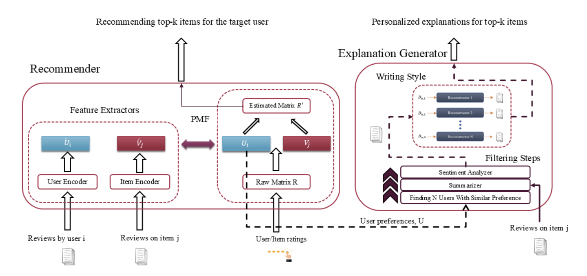

# A Framework for Generating Explainable Recommendations via Multi-Task Learning

## 📖 Abstract
Recommendation systems predict items or services that users might find desirable based on their past interactions (e.g., ratings, likes, shopping history). However, these systems face several challenges:  

1. **Data insufficiency** – limited information about user preferences.  
2. **Lack of transparency** – users cannot understand why items are recommended.  

Leveraging **user reviews** can help address these challenges:  
- Reviews convey user preferences, providing **additional data** for better recommendations.  
- Reviews can generate **textual explanations**, improving transparency.

With the growing attention to **Responsible AI (RAI)**, it is increasingly important for recommender systems to provide **explainable recommendations**. Transparency, a key principle of RAI, allows users to understand the reasoning behind AI predictions. Therefore, e-commerce platforms and other systems using recommender models should provide explanations to act responsibly.

While text-based explanations are common in many explainable recommendation systems, prior works often neglect the **writing style of users**, which can impact the effectiveness of explanations.  

The main goal of this work is to develop a **novel framework** that generates explainable recommendations by incorporating both **user preferences** and **user writing styles** into the explanation generation process.

---

## 🖼️ Framework Diagram

---

## 🔑 Keywords
- Recommender System  
- Responsible AI  
- Multi-Task Learning  
- Explanation Generation  
- Explainable Recommendation  
- Text Reconstruction

---

## ⚙️ Highlights
- Incorporates user **writing style** into explanation generation.  
- Uses **multi-task learning** to predict recommendations and generate explanations simultaneously.  
- Promotes **transparency and ethical AI practices** in recommendation systems.

---

## Publication

This repository contains the implementation accompanying our paper:

**A Framework for Accurate Recommendation and Explanation Generation Using Multi-task Learning**  
Mohammad Mobin Shahidi, Amin Nazari, and Muharram Mansoorizadeh  
*SN Computer Science*, 7, 775 (2026).

📄 [Read the paper](https://doi.org/10.1007/s42979-026-05361-2)
